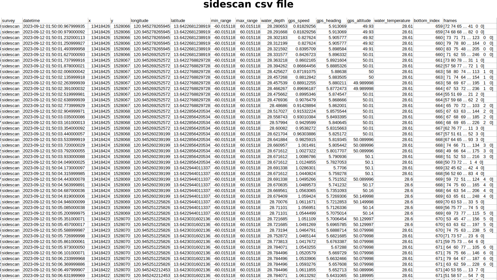
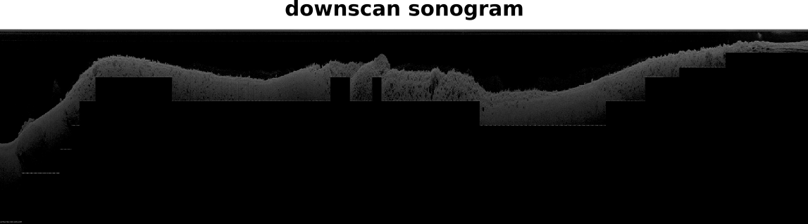
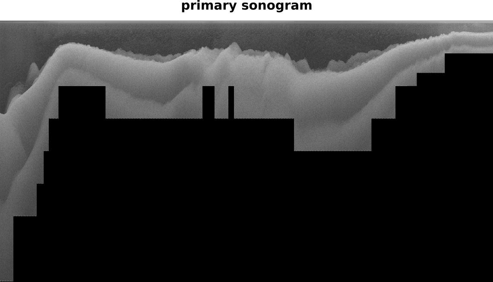
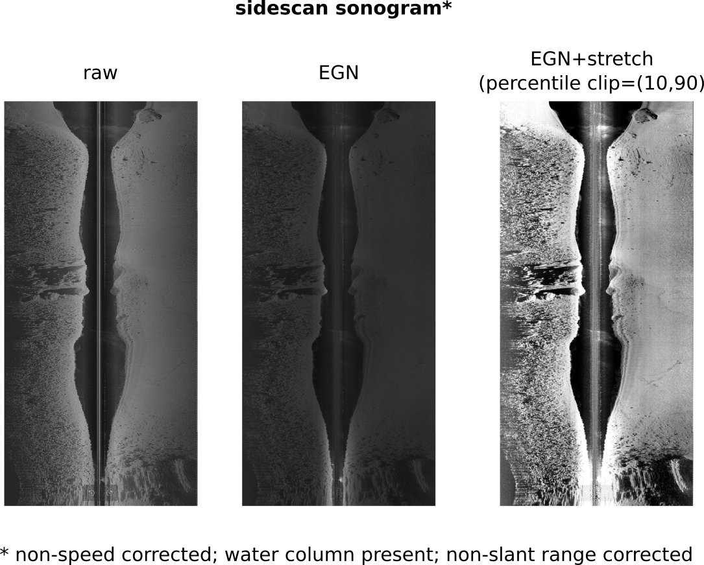
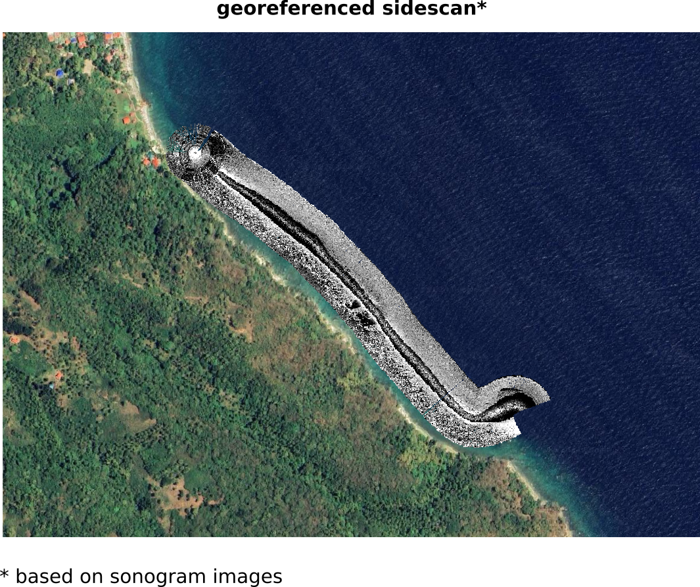
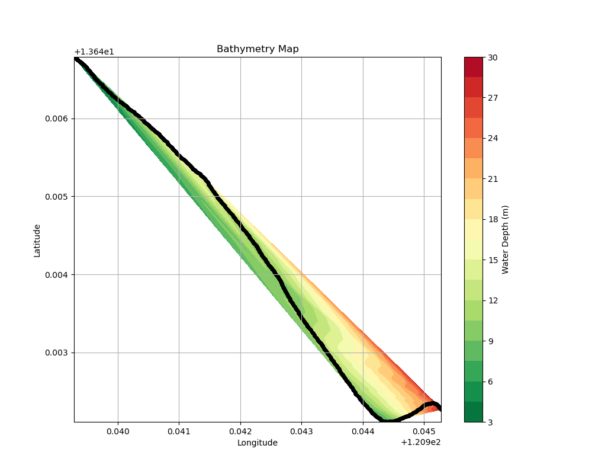

# Lowrance Sonar Data Explorer

## Quick start
0. Run `pip install -r requirements.txt`.
1. Edit `SL2` file path at `default.yaml`.
2. Run `run_lowmapper.ipynb` via `Run All`.
3. Folder outputs are at `runs` folder.

## Features

| `PingMapper` | `Lowrance` | Implemented |
| - | - | - |
| Decode **Humminbird® (tested on 1197, 1198, 1199, Helix, Solix, Onix)**. | **Lowrance® (tested on SL2)**. | **Done** |
| Export **all metadata from .DAT and .SON** files to .CSV. | **(not all) ping values from .SL2 files**; limited to available data (https://wiki.openstreetmap.org/wiki/SL2) | **Done** | 
| Automatically detect depth (i.e. Zheng et al. 2021) and shadows in side scan channels. | - |**Done** (using sensor) |
| Correct sonar backscatter with Empiracle Gain Normalization. | - | **Done** |
| Export **un-rectified sonar tiles** with water column present (WCP) AND/OR export un-rectified sonograms with water column removed (WCR) using **Humminbird** depth estimates OR automated depth detections. | term used: sonogram images; **Lowrance** | **Done** (`WCP`); for fixing (`WCR`) |
| Export speed corrected **un-rectified sonograms**. | term used: sonogram images |  |
| Smooth and interpolate GPS track points. | - |  |
Export **georectified** WCP (spatially inaccurate due to presence of water column) AND/OR WCR sonar imagery for use in GIS w/wo shadows removed. | term used: georeferenced | **Done** (`WCP`); for fixing (`WCR`) |
| Mosaic **georectified** sonar imagery. | term used: georeferenced | |
| Automatically segment and classify substrate patches. | - | *ongoing* |

## Added Features
| Features | Implemented |
| - | - |
| Export track points as shapefile with water depth column | **Done** |
| Export raster bathymetry map plot (.PNG) | **Done** |

## Screenshots

